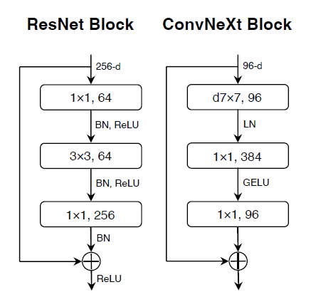

# ConvNeXt-tf-keras
tf-keras re-implementation of ConvNeXt [1] from Facebook Research.

# Usage
There are two ways one can use this implementation:
  * Notebook (.ipynb)
    - Simply run the cells
  * .py file

## Example of using .py version
```python
from main import create_convnext_model

model = create_convnext_model(input_shape=(224, 224, 3), depths=[3, 3, 9, 3], dims=[96, 192, 384, 768], num_classes=1000)
print(model.summary())
```

# References
Paper:

[1]  [https://arxiv.org/abs/2201.03545](A ConvNet for the 2020s)

Code:

[2] https://github.com/facebookresearch/ConvNeXt

[3] https://github.com/rishigami/Swin-Transformer-TF
